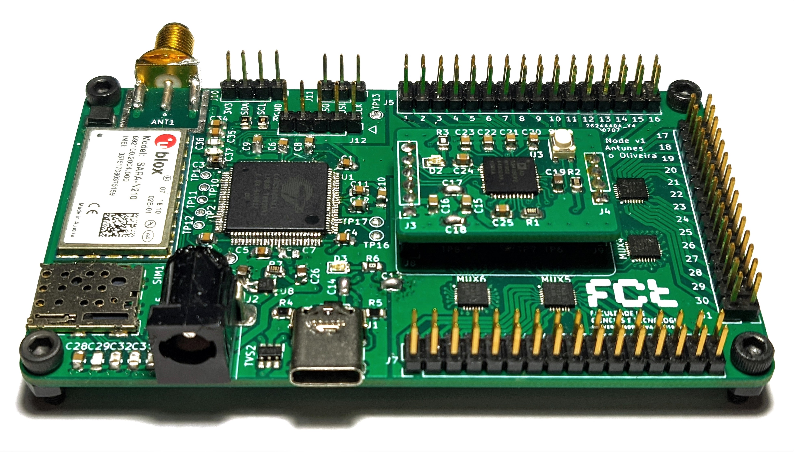

# KNoT High Precision IoT Sensor Node

This sensor node was developed as a masters thesis project, with the objective of achieving high precision measurements of several sensors of any type, including those which can present some challenges such as water conductivity or pH sensors.

In order to achieve this a Cypress PSoC 5LP Microcontroller was used due to its 20-bit internal ADC, alongside an optional Analog Devices AD5941 High Precision, Impedance & Electrochemical Front End.

Wired communications are handled by various protocols, such as I2C, SPI and UART, while wireless communications are handled by a u-blox SARA N2 NB-IoT module.

